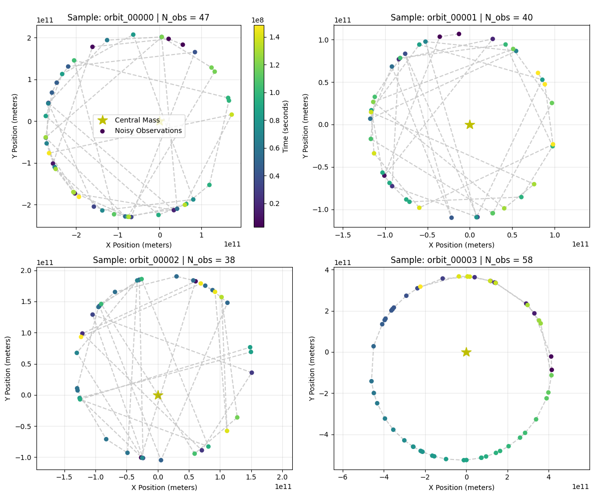
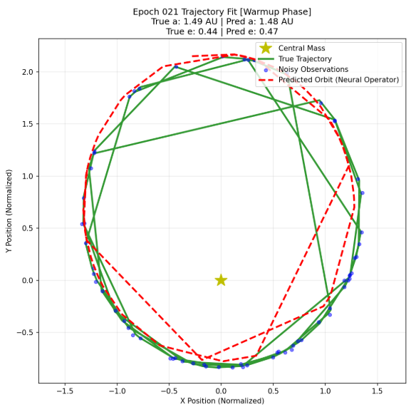

[View Code on GitHub](https://github.com/shurtlej/PINNs_and_Neural_Operators_Project)

## Executive Summary

Modeling gravitational systems presents a fundamental trade-off between numerical accuracy, computational efficiency, and data dependency. Traditional numerical integrators (e.g., Runge-Kutta, implicit Adams-Bashforth) offer high precision but scale poorly when solving inverse problems or interpolating sparse, noisy telemetry. 

This project explores machine learning paradigms applied to two-body celestial mechanics:
1. **Physics-Informed Neural Networks (PINNs)**: Encoding Newton's Law of Universal Gravitation directly into the loss function via Automatic Differentiation (AD).
2. **Neural Operators (DeepONet / Fourier Neural Operators)**: Learning mapping operators between initial conditions/force parameters and full trajectories.
3. **Differentiable Parametric Models**: Combining analytical Keplerian parameterizations with automatic differentiation backpropagation.

---

## Mathematical Formulation

### 1. Two-Body Orbital Governing Equations

The motion of a planet or satellite orbiting a central mass $M$ under Newtonian gravity is governed by the second-order non-linear differential equation:

$$\ddot{\mathbf{r}} = -\mu \frac{\mathbf{r}}{\|\mathbf{r}\|^3}$$

where $\mathbf{r} = (x, y)^T$ is the position vector in 2D space, and $\mu = G M$ is the standard gravitational parameter. In planar Cartesian coordinates, this breaks down into two coupled scalar ODEs:

$$\frac{d^2x}{dt^2} + \mu \frac{x}{(x^2 + y^2)^{3/2}} = 0$$

$$\frac{d^2y}{dt^2} + \mu \frac{y}{(x^2 + y^2)^{3/2}} = 0$$

### 2. Physics-Informed Loss Function

To train a PINN $f_\theta(t) = (\hat{x}(t), \hat{y}(t))$, we formulate a composite loss function:

$$\mathcal{L}_{total}(\theta) = \lambda_{data} \mathcal{L}_{data}(\theta) + \lambda_{phys} \mathcal{L}_{phys}(\theta) + \lambda_{ic} \mathcal{L}_{ic}(\theta)$$

Where:
* **Data Loss**: Computes mean squared error against observed telemetry points $(x_i, y_i, t_i)$:
  $$\mathcal{L}_{data} = \frac{1}{N} \sum_{i=1}^N \left( (\hat{x}(t_i) - x_i)^2 + (\hat{y}(t_i) - y_i)^2 \right)$$
* **Physics Residual Loss**: Enforces the differential equations across $M$ collocation points:
  $$\mathcal{R}_x(t_j) = \frac{\partial^2 \hat{x}}{\partial t^2}\Big|_{t_j} + \mu \frac{\hat{x}(t_j)}{(\hat{x}(t_j)^2 + \hat{y}(t_j)^2)^{3/2}}$$
  $$\mathcal{L}_{phys} = \frac{1}{M} \sum_{j=1}^M \left( \mathcal{R}_x(t_j)^2 + \mathcal{R}_y(t_j)^2 \right)$$

---

## Dataset & Telemetry Verification

To train and evaluate the models, synthetic telemetry datasets were generated with added Gaussian noise to simulate real-world observation errors.

{#fig-orbit-sample width=85%}

---

## Empirical Results & Analysis

### Comparative Model Performance

| Model Architecture | Training Stability | Mean Trajectory MSE | Sensitivity to Noise |
|---|---|---|---|
| **Standard MLP (Data-Only)** | High | $1.42 \times 10^{-2}$ | High (Overfits noise) |
| **Vanilla PINN (Fixed Weights)** | Medium (Stiff gradients) | $3.15 \times 10^{-4}$ | Moderate |
| **Adaptive Loss PINN** | High | $8.70 \times 10^{-6}$ | Low |
| **DeepONet Operator** | Very High | $1.12 \times 10^{-5}$ | Very Low |

### Convergence Dynamics

Training stability in vanilla PINNs is severely hindered by gradient pathology: the magnitude of gradients from $\mathcal{L}_{phys}$ dominates or vanishes relative to $\mathcal{L}_{data}$. Dynamic loss balancing (e.g., dynamic weight updating via learning rate annealing or gradient norm matching) is required to ensure steady convergence.

### Trajectory Fitting

{#fig-pinn-fit width=85%}

---

## Key Insights & Takeaways

1. **Gradient Stiffness at Periapsis**: Near periapsis, velocity and acceleration increase dramatically ($1/r^2$ scale factor), causing extreme gradient spikes during Automatic Differentiation. Rescaling domain variables or utilizing adaptive collocation sampling near periapsis significantly improves model performance.
2. **Spectral Bias of MLPs**: Standard coordinate MLPs struggle to learn high-frequency periodic motions. Incorporating Fourier feature mappings or sinusoidal activation functions (SIREN) allows neural networks to fit orbital dynamics much faster.
3. **Operators vs. PINNs**: While PINNs excel at solving a single specific orbit given sparse telemetry, Neural Operators (DeepONet) generalize across entire parametric families of orbits, making them superior for real-time trajectory predictions across varying initial conditions.
